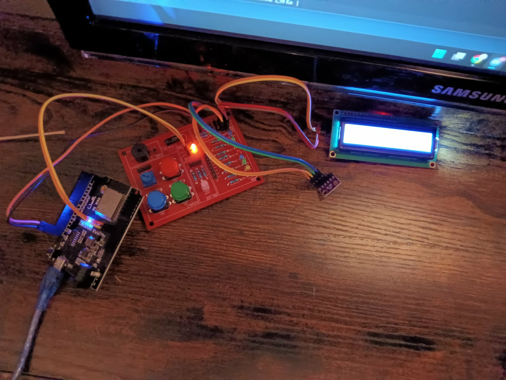
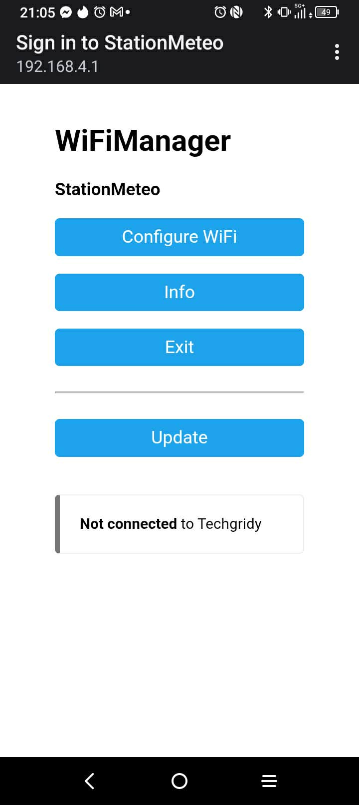
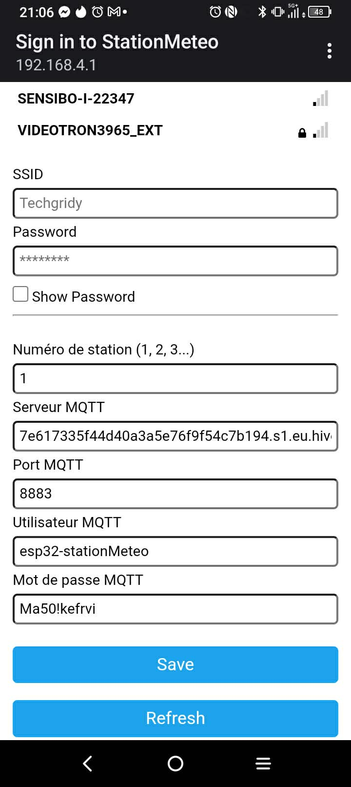
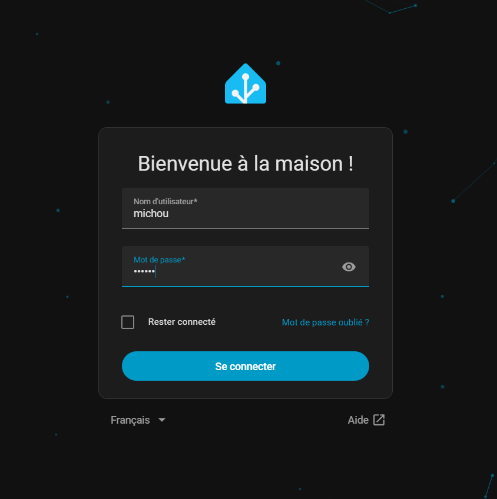
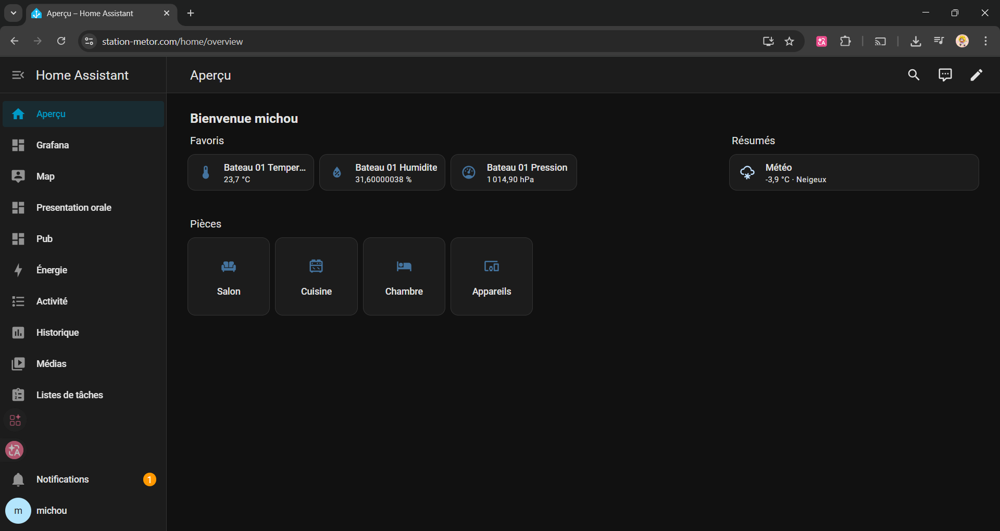
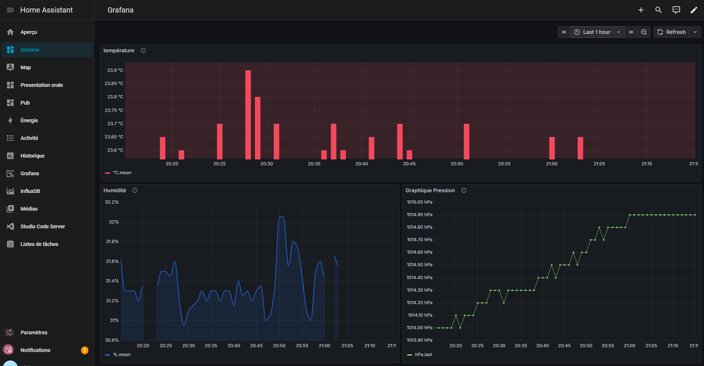

<!-- PROJECT LOGO -->
 

  

  <h3 align="center">Métor 🦆</h3>

  

     
    <a href="#about"><strong>Explore the screenshots »</strong></a>
       
       
      <a href="https://github.com/DFC-Informatique-Cegep-de-Sainte-Foy/r-ab_bh/issues/new?assignees=&labels=bug&template=01_BUG_REPORT.md&title=bug%3A+">Report a Bug</a>
      ·
      <a href="https://github.com/DFC-Informatique-Cegep-de-Sainte-Foy/r-ab_bh/issues/new?assignees=&labels=enhancement&template=02_FEATURE_REQUEST.md&title=feat%3A+">Request a Feature</a>
      ·
      <a href="https://github.com/DFC-Informatique-Cegep-de-Sainte-Foy/r-ab_bh/issues/new?assignees=&labels=question&template=04_SUPPORT_QUESTION.md&title=support%3A+">Ask a Question</a>
  

## Table des matières
  <ol>
    <li><a href="#projet-meteor">Projet Meteor</a></li>
    <li><a href="#documentation-technique">Documentation technique</a></li>
    <li>
      <a href="#manuel-dutilisation-mode-demploi">Manuel d'utilisation</a>
      <ul>
        <li><a href="#installation-du-boîtier">Installation du boîtier</a></li>
        <li><a href="#visualisation-de-vos-données">Visualisation de vos données</a></li>
      </ul>
    </li>
    <li><a href="#démonstration-visuelle">Démonstration visuelle</a></li>
    <li><a href="#auteurs--contributeurs">Auteurs & contributeurs</a></li>
    <li><a href="#Remerciements">Remerciements</a></li>
  </ol>

## Projet Meteor
Meteor est une solution météo maritime clé en main. 
Elle se compose d'un boîtier intelligent conçu pour collecter 
et visualiser les données environnementales (température, humidité, pression)
sans nécessiter une connexion internet permanente.

Contrairement aux stations météo résidentielles, 
Meteor est optimisée pour la réalité des navigateurs.
- En mer (Mode hors-connexion) : La station enregistre chaque mesure 
localement. Elle continue de travailler même sans connexion.
- Au port (Mode connexion) : Dès que le bateau s'approche et 
détecte le réseau du port, Meteor "vide" sa mémoire et transmet 
toutes les données accumulées vers notre serveur sécurisé.

## Documentation technique

Pour ne pas perdre une seule 
seconde de ta traversée, le pipeline suit ces étapes :

1 - Le capteur prend une lecture toutes les 2 minutes.

2 - La donnée est stockée avec un Timestamp (heure exacte de la lecture) 
pour que les graphiques soient précis même si l'envoi est retardé.

3 - La station tente périodiquement de joindre station-meteor.com

4 - Une fois le port atteint, les données sont envoyées en rafale vers InfluxDB

5 - Une fois les données injectées dans InfluxDB, Grafana traite l'historique complet
grâce au Timestamp enregistré, les graphiques reconstruisent fidèlement la courbe de 
température et de pression tout au long de la traversée.

## Manuel d'utilisation (Mode d'emploi)

L'expérience Meteor est conçue pour être la plus simple possible : **Branchez**, **naviguez**, **visualisez**.

### Installation du boîtier
- Plug & Play : Fixez le boîtier Meteor sur votre navire et branchez-le à une source d'alimentation.
- Configuration zéro : Le boîtier est déjà entièrement programmé. Il commencera à enregistrer vos données immédiatement.
- Connexion automatique : Grâce au partenariat avec Navigator Inc., Meteor reconnaît automatiquement les réseaux Wi‑Fi des ports et s’y connecte sans intervention.
- Connection manuel : Si vous préférez choisir ou configurer un réseau vous‑même, un portail dédié est disponible.

### Visualisation de vos données
Pour consulter vos graphiques en temps réel ou l'historique de vos sorties :
1 - Connectez-vous à l'adresse suivante : https://station-metor.com

2 - Connectez-vous avec les identifiants et mot de passe qui vous ont été fournis lors de votre achat. (Compte pour tester -> user : michou | passw: michou)

3 - Votre tableau de bord personnalisé s'affichera avec toutes les données de votre boîtier.

## Démonstration visuelle

  

    
      📂 Ouvrir le panneau
    
  

   
  🛠️ Installation Process  

Composants du boitier :
  
Portail captif - Configuration manual
  

  

Portail de connetion de Home Assistant
  

Tableau de bord de Home Assistant :
  

  

## Auteurs & contributeurs

* [Billy Hallé](https://github.com/majeurbilly/)
* [Antony Burlet](https://github.com/AntonyBurlet/)

## Remerciements

Remerciment:

* [Madame Michou](https://avatars.githubusercontent.com/u/7636441?v=4)
* [La vie](https://youtu.be/uW3gShN8als?si=bVX2vbbrAz9wvg7u&t=1798/)

(<a href="#">retour en haut</a>)

